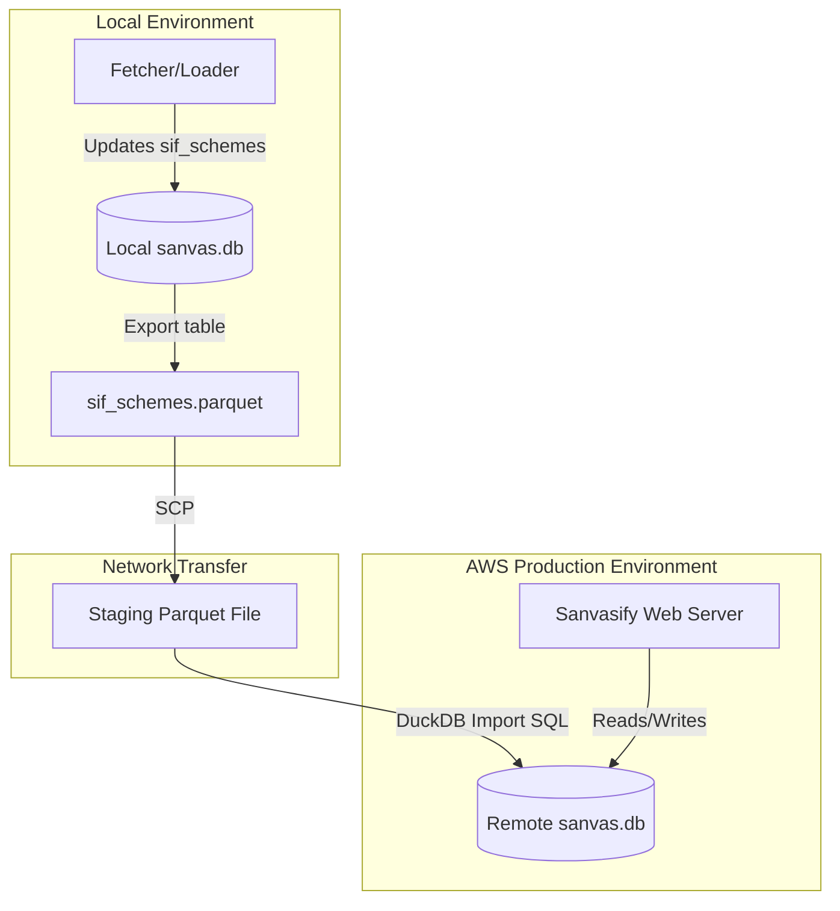
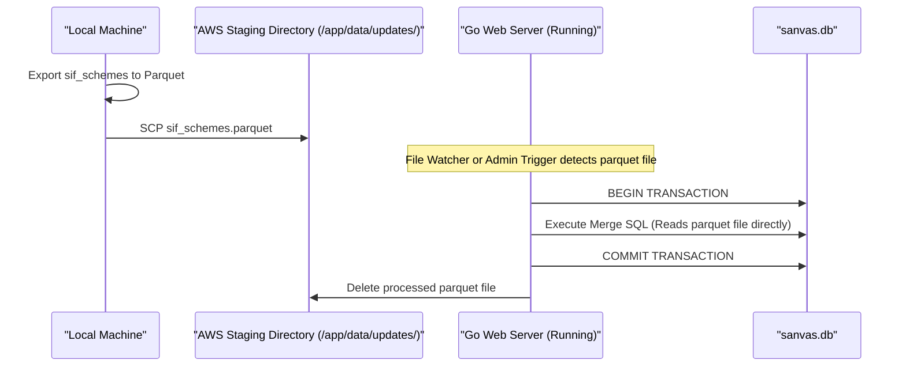
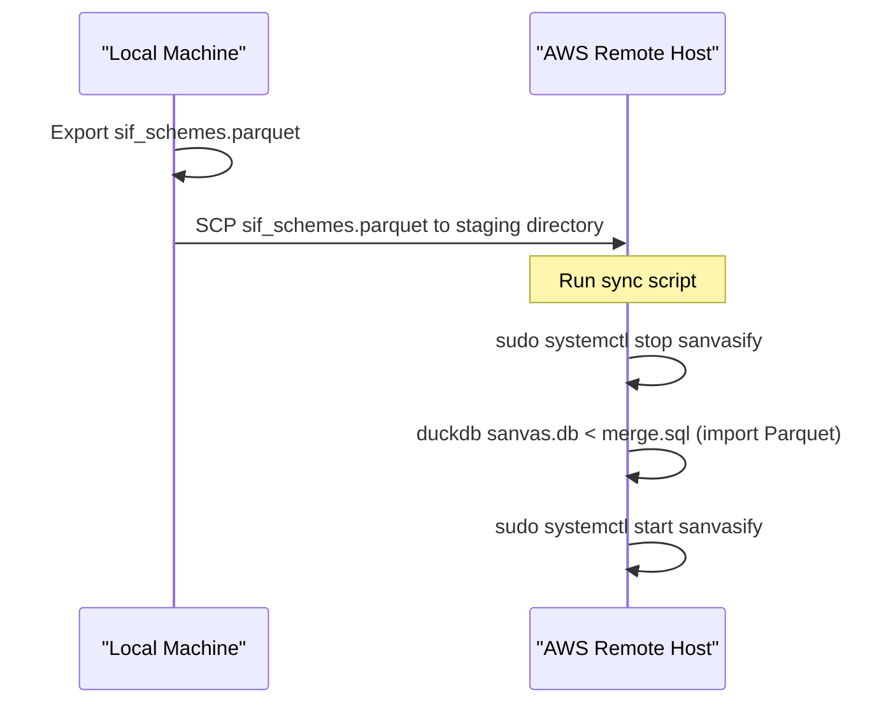

# Database Expansion Strategy: Multi-Table Consolidation & Granular Synchronization

This document defines the strategy for transitioning from the legacy single-table `sanvasify.db` setup to a consolidated, multi-table database (`sanvas.db`). It also outlines how to sync individual tables to the remote AWS environment without overwriting the entire database file, and includes the implementation plan to retire the proposed split-database `metrics.db` design.

---

## 1. Objective
Currently, `sanvasify.db` is replaced entirely on the AWS production instance via `scp` during every update cycle. This approach:
- Overwrites any server-side database state (such as the `visitors` tracking table).
- Increases network usage as the single table grows.
- Prevents scaling to multiple tables where some tables are updated locally (e.g., market data) and others are updated on the server (e.g., user sessions, metrics, visitors).

**Goal:** A consolidated database (`sanvas.db`) containing multiple tables (e.g., `sif_schemes` and `visitors`). The `fetcher` and `loader` update only `sif_schemes` locally, and the synchronization process updates only the `sif_schemes` table on AWS via table-level Parquet transfers using [sync_db.sh](file:///Users/raghavgarg/Projects/myGo/sanvasify/scripts/sync_db.sh), keeping the live `visitors` table untouched.

---

## 2. Proposed Architecture




### Table Schema Mapping (Consolidated `sanvas.db`)
- `sif_schemes`: Holds NAV history and schemes metadata (updated locally, pushed to AWS).
- `visitors`: Holds server-side analytics (updated only on AWS, completely untouched by local sync).

---

## 3. Granular Table Synchronization Flow

Instead of replacing the entire database file, we perform a table-level sync using **Parquet exports** via [sync_db.sh](file:///Users/raghavgarg/Projects/myGo/sanvasify/scripts/sync_db.sh). This ensures the `visitors` table (which is updated live by users on AWS) remains entirely untouched.

### The Concurrency Challenge (DuckDB File Locking)
DuckDB operates as an embedded database. It allows multiple concurrent readers **or** a single writer. When the `sanvasify` Go application runs on AWS:
- It opens `sanvas.db` in read-write mode to record visitor metrics in the `visitors` table.
- This creates an exclusive write-lock on the database file.
- Any attempt by an external `duckdb` CLI process to write to `sanvas.db` will fail with a file-locking error (`IOException: Could not set lock on file`).

To update `sif_schemes` on AWS without hindering the `visitors` table or causing application downtime, we propose two distinct strategies:

---

### Strategy A: Application-Led Merging (Recommended - Zero Downtime)
In this strategy, the running `sanvasify` Go web server performs the merge itself using its existing database connection. Since the application already holds the write-lock, no lock contention occurs.




#### Step-by-Step Implementation:
1. **Local Export:** Export the local `sif_schemes` table to a compressed Parquet file:
   ```sql
   COPY (SELECT * FROM sif_schemes) TO 'data/sif_schemes.parquet' (FORMAT 'PARQUET', COMPRESSION 'ZSTD');
   ```
2. **Secure Transfer:** SCP the `sif_schemes.parquet` file to a designated staging directory on AWS (e.g., `/opt/sanvasify/data/updates/sif_schemes.parquet`).
3. **Execution Options in Go Code:**
   - **Option A (Background Watcher):** A background goroutine periodically scans `/opt/sanvasify/data/updates/`. When it detects `sif_schemes.parquet`, it locks a mutex, opens a transaction on `d.conn`, executes the Merge SQL statement, commits, and deletes the parquet file.
   - **Option B (Admin API Hook):** Expose a secure, authenticated `/admin/sync-db` POST endpoint. After the SCP completes, the local sync script sends a request to this endpoint to trigger the merge.
4. **Merge SQL Statement:**
   ```sql
   -- Create table if it does not exist (precautionary)
   CREATE TABLE IF NOT EXISTS sif_schemes (
       scheme_code VARCHAR NOT NULL,
       scheme_name VARCHAR NOT NULL,
       isin_div_payout_growth VARCHAR,
       isin_div_reinvestment VARCHAR,
       net_asset_value DOUBLE,
       repurchase_price DOUBLE,
       sale_price DOUBLE,
       date DATE NOT NULL,
       strategy_name VARCHAR,
       fund_house_name VARCHAR,
       fund_type VARCHAR,
       fund_company VARCHAR,
       fund_strategy VARCHAR,
       distribution_option VARCHAR,
       purchase_mode VARCHAR,
       PRIMARY KEY (scheme_code, date)
   );

   -- Atomic merge from the uploaded Parquet file
   INSERT INTO sif_schemes 
   SELECT * FROM read_parquet('/opt/sanvasify/data/updates/sif_schemes.parquet')
   ON CONFLICT (scheme_code, date) DO UPDATE SET 
       scheme_name = EXCLUDED.scheme_name,
       isin_div_payout_growth = EXCLUDED.isin_div_payout_growth,
       isin_div_reinvestment = EXCLUDED.isin_div_reinvestment,
       net_asset_value = EXCLUDED.net_asset_value,
       repurchase_price = EXCLUDED.repurchase_price,
       sale_price = EXCLUDED.sale_price,
       strategy_name = EXCLUDED.strategy_name,
       fund_house_name = EXCLUDED.fund_house_name,
       fund_type = EXCLUDED.fund_type,
       fund_company = EXCLUDED.fund_company,
       fund_strategy = EXCLUDED.fund_strategy,
       distribution_option = EXCLUDED.distribution_option,
       purchase_mode = EXCLUDED.purchase_mode;
   ```

**Pros:**
- **Zero Downtime:** Web app remains fully operational.
- **Transactional Safety:** Merges are performed atomically inside a transaction.
- **Isolation:** The `visitors` table remains completely untouched and open for writes throughout.

---

### Strategy B: Brief Service Suspension (Fallback)
If we prefer not to add file-watching or admin routes to the Go codebase, we can perform a script-based merge during off-peak hours by briefly stopping the service to release the file lock.




#### Step-by-Step Implementation:
1. **Local Export:** Export the local `sif_schemes` table to `sif_schemes.parquet`.
2. **Transfer:** SCP the parquet file to `/home/ec2-user/sif_schemes.parquet` on AWS.
3. **Execution via deployment script ([sync_db.sh](file:///Users/raghavgarg/Projects/myGo/sanvasify/scripts/sync_db.sh)):**
   ```bash
   # 1. Stop service to release lock
   sudo systemctl stop sanvasify

   # 2. Execute DuckDB CLI merge
   duckdb /opt/sanvasify/data/sanvas.db <<EOF
   -- (Insert schema definition if not exists)
   INSERT INTO sif_schemes 
   SELECT * FROM read_parquet('/home/ec2-user/sif_schemes.parquet')
   ON CONFLICT (scheme_code, date) DO UPDATE SET 
       scheme_name = EXCLUDED.scheme_name,
       isin_div_payout_growth = EXCLUDED.isin_div_payout_growth,
       isin_div_reinvestment = EXCLUDED.isin_div_reinvestment,
       net_asset_value = EXCLUDED.net_asset_value,
       repurchase_price = EXCLUDED.repurchase_price,
       sale_price = EXCLUDED.sale_price,
       strategy_name = EXCLUDED.strategy_name,
       fund_house_name = EXCLUDED.fund_house_name,
       fund_type = EXCLUDED.fund_type,
       fund_company = EXCLUDED.fund_company,
       fund_strategy = EXCLUDED.fund_strategy,
       distribution_option = EXCLUDED.distribution_option,
       purchase_mode = EXCLUDED.purchase_mode;
   EOF

   # 3. Clean up the parquet file
   rm -f /home/ec2-user/sif_schemes.parquet

   # 4. Restart service
   sudo systemctl start sanvasify
   ```

**Pros:**
- Simpler codebase (no background workers or HTTP hooks).
- Safe because the service is stopped, preventing concurrent writes to `visitors` while the merge runs.

**Cons:**
- **Minor Downtime:** The web application is offline for the duration of the DuckDB CLI command (typically <5 seconds).
- Any visitor actions during this window will fail.

---

### Data Integrity & Safety Controls
Regardless of the strategy chosen:
1. **Transactional Execution:** DuckDB commands should always run within a SQL transaction so that any failure during parquet parsing rolls back changes, preventing partial table updates.
2. **Schema Verification:** Ensure any schema changes to `sif_schemes` locally are automatically matched in the `CREATE TABLE IF NOT EXISTS` block on production.
3. **Backup Routine:** Before running a merge (Strategy A or B), create an automated snapshot of the active `sanvas.db` (e.g. `cp sanvas.db sanvas.db.bak`) to guarantee rollback recovery in case of file corruption.

---

## 4. Codebase Implementation Plan: Retiring `metrics.db`

Because the separate `metrics.db` database was never deployed to production, we are completely dropping that implementation to avoid unnecessary complexity. The visitor metrics will be tracked inside a single database connection (the active database file).

### Step 1: Clean Up Database Connection in Go Code ([pkg/db/db.go](file:///Users/raghavgarg/Projects/myGo/sanvasify/pkg/db/db.go))
- Remove the `metricsConn *sql.DB` field from the `DB` struct.
- In `New(dbPath string)`, delete the logic that constructs, pings, or resolves the path to `metrics.db`.
- In `Close()`, remove references to closing `d.metricsConn`.
- In `InitSchema(ctx)`, execute the creation of the `visitors` table directly on the primary connection (`d.conn`).
- Update `RecordVisit` and `GetUniqueVisitorCount` to run their queries directly on the primary connection (`d.conn`).

### Step 2: Verification
- Build and run the project locally using `go build ./...` to verify there are no compilation errors or broken references.

---

## 5. Phased Rollout Plan

To guarantee that production operations are not disrupted, the transition to the consolidated `sanvas.db` will be implemented in phases:

### Phase 1: Keep Legacy Database `sanvasify.db` Active
- **Actions:**
  - Both `sanvasify.db` and the new `sanvas.db` are present on disk.
  - The Go web application continues to read and write exclusively from/to the legacy `sanvasify.db`.
  - No database visitor tracking table is initialized on the new `sanvas.db` yet.
- **Status:** **Completed.**

### Phase 2: Deploy `sanvas.db` with Schemes & Visitors and Verify Sync (Strategy B)
- **Actions:**
  - Create the new `sanvas.db` schema containing both the `sif_schemes` and `visitors` tables.
  - Set up and test the new synchronization pipeline (based on **Strategy B: Brief Service Suspension**) in the local/AWS environments.
  - The sync script will periodically:
    1. Export `sif_schemes` to `sif_schemes.parquet` locally.
    2. SCP it to AWS.
    3. Briefly stop the server, merge the Parquet data into `sif_schemes` inside `sanvas.db` on AWS, and restart the server.
  - Throughout this phase, the active Go web server on AWS still runs and serves queries off the live legacy `sanvasify.db`.
- **Status:** **Completed.** The synchronization pipeline has been implemented in [sync_dbv2.sh](file:///Users/raghavgarg/Projects/myGo/sanvasify/scripts/Archive/sync_dbv2.sh) (now replaced by the consolidated [sync_db.sh](file:///Users/raghavgarg/Projects/myGo/sanvasify/scripts/sync_db.sh)) and tested successfully once. Both databases are fully available on AWS. The sync script is not yet scheduled.

### Phase 3: Switchover to `sanvas.db` and Keep `sanvasify.db` as Fallback
- **Actions:**
  - Migrate any production visitor data collected in the legacy `sanvasify.db`'s `visitors` table into the unified `sanvas.db` on AWS.
  - Reconfigure the Go application to point entirely to `sanvas.db` for all database operations (both schemes and visitor tracking).
  - Retain the old `sanvasify.db` on the AWS instance purely as a fallback/backup database.
- **Status:** **Configured & Tested.** The switchover script [switch_db.sh](file:///Users/raghavgarg/Projects/myGo/sanvasify/scripts/switch_db.sh) has been created and tested to allow seamless toggling between the databases on AWS.

---

## 6. Completed Work & Script Reference

### Loader & Local Prep
- **Go Loader Updates ([cmd/load/main.go](file:///Users/raghavgarg/Projects/myGo/sanvasify/cmd/load)):** Modified to populate and keep both local database files (`sanvasify.db` and `sanvas.db`) updated.
- **Legacy Sync Update ([scripts/sync_db.sh](file:///Users/raghavgarg/Projects/myGo/sanvasify/scripts/sync_db.sh)):** Updated to run local loading steps on both database files before syncing the legacy database to AWS.

### Modern Database Management Scripts
- **Database Sync Script ([scripts/sync_db.sh](file:///Users/raghavgarg/Projects/myGo/sanvasify/scripts/sync_db.sh)):**
  - Performs local database prep on both files.
  - Exports local `sif_schemes` to a compressed Parquet file using DuckDB.
  - Transfers the Parquet file to AWS staging.
  - Suspends AWS services, takes a backup of `sanvas.db` to `sanvas.db.bak`, merges table data atomically using DuckDB CLI, and restarts services.
  - *Status:* Verified successfully with a one-time test run. Not yet scheduled on a cron/timer.
- **Database Switch Script ([scripts/switch_db.sh](file:///Users/raghavgarg/Projects/myGo/sanvasify/scripts/switch_db.sh)):**
  - Connects to AWS to dynamically update the active `db_path` inside the web application configuration (`/opt/sanvasify/config/Config.toml`).
  - Clears stale WAL files and restarts service daemons to ensure a clean switchover.
  - Supports switching targets between `sanvas` and `sanvasify`.
  - *Status:* Tested once and worked successfully in AWS.

